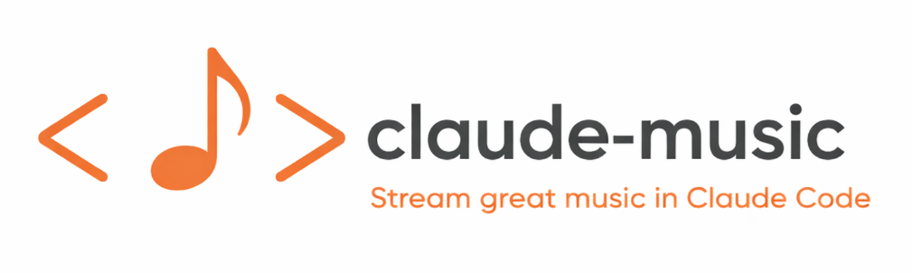

<p align="center">
  
</p>

# claude-music marketplace

A Claude Code plugin marketplace for [claude-music](https://github.com/kennethleungty/claude-music) — background music for your AI coding agent sessions.

## Installation

In Claude Code, register the marketplace:

```
/plugin marketplace add kennethleungty/claude-music-marketplace
```

Then install the plugin:

```
/plugin install claude-music@claude-music-marketplace
```

## Available Plugins

### claude-music

Background music for your coding sessions — lofi, jazz, classical, ambient, electronic, and more. Streaming live from the internet, right in your terminal.

```
/plugin install claude-music@claude-music-marketplace
```

No setup, no accounts, no ads. Just install and play.

**Commands:** `/play`, `/stop`, `/vibe`, `/mood`, `/focus`, `/volume`, `/next`, `/status`, and more.

[Full documentation →](https://github.com/kennethleungty/claude-music)

## License

Marketplace metadata is MIT licensed. The claude-music plugin has its own [license](https://github.com/kennethleungty/claude-music/blob/main/LICENSE).
